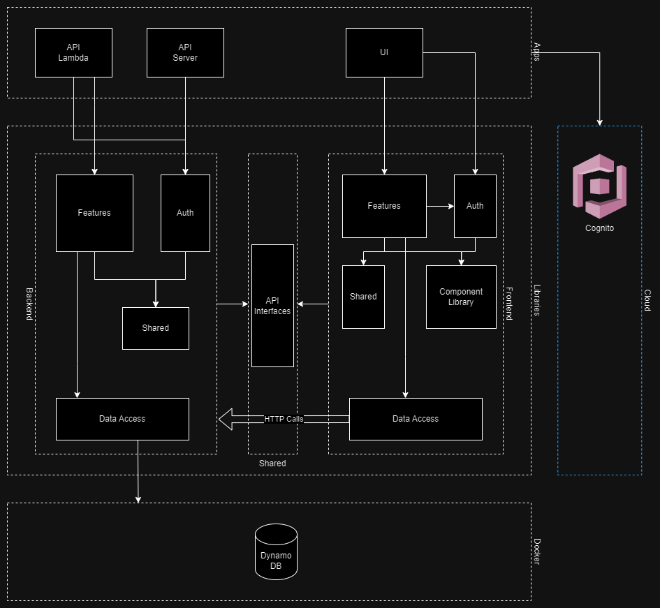
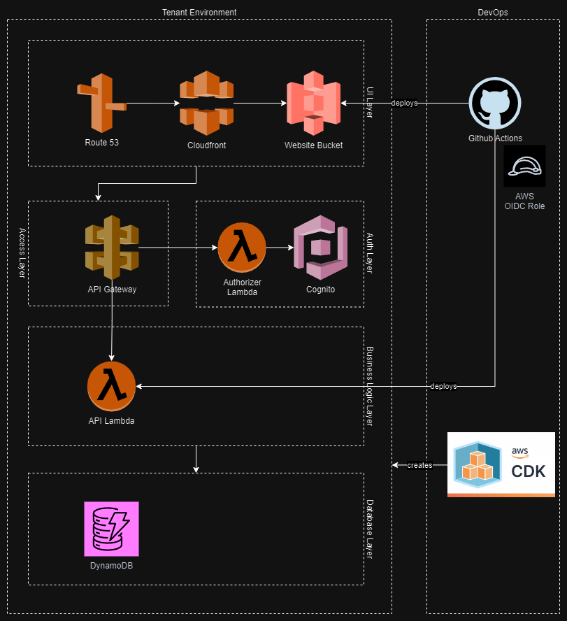

# Architecture

## Local Environment

A Cognito user pool is required for the authentication layer.

## Infrastructure Overview

Assuming AWS as the cloud provider, the diagram below outlines the relevant services:

